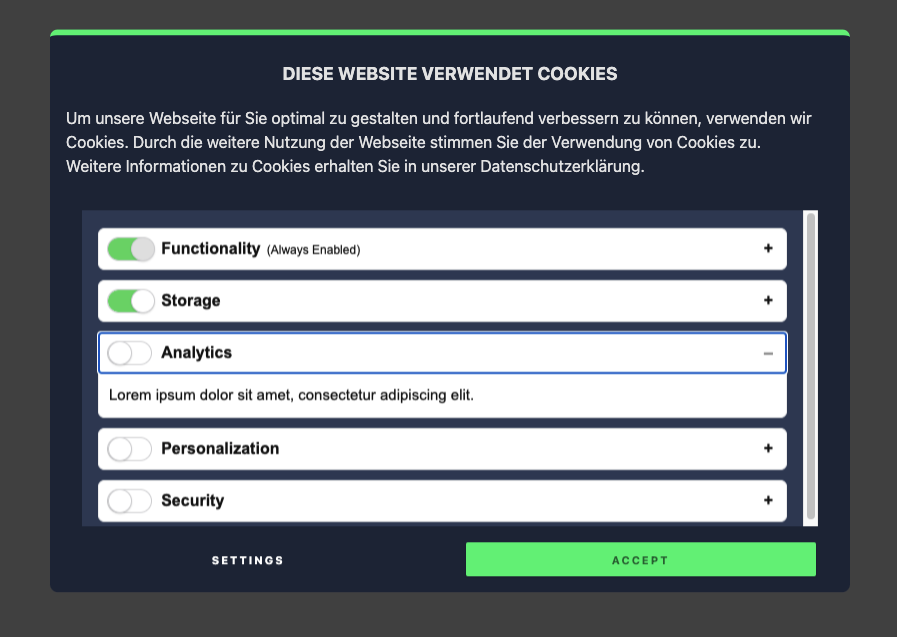
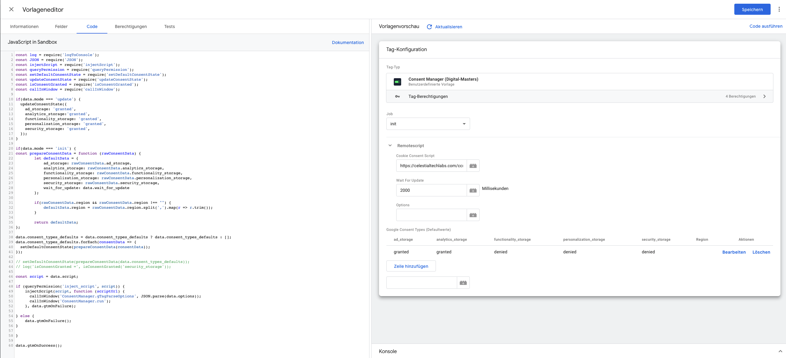

# Consent Manager (WIP)

### Einleitung

Der Consent Manager ist eine Neuentwicklung basierend auf dem Cookie Consent Manager von DM und dem im nachfolgenden 
veröffentlichten Features von Google´s Consent Mode. 
Dieser ist ein Hilfsmittel zur rechtskonformen Umsetzung der [General Data Protection Regulation (GDPR) der EU](https://gdpr.eu/)
, und dem [California Consumer Privacy Act (CCPA)](https://oag.ca.gov/privacy/ccpa).

### Features

- Kann als Google Tag installiert und konfigurert werden
- Akzeptiert automatisch die Browservoreinstellung “do not Tracking“
- Erkennt selbstständig Crawler wie “Google Search” oder “Baidu“
- Kann für Besucher aus unterschiedlichen Ländern anders vorkonfiguriert werden.
- i18n

## WORK IN PROGRESS
- Liste aller Cookies
- Update Tag Manager Consents
- Reduce Bundler Output
- Cleanup

## Screenshots




## Setup

```
yarn install
```

```
yarn dev
```

CDN: https://ecstatic-edison-185003.netlify.app/ccm.js

CDN-Modern: https://ecstatic-edison-185003.netlify.app/ccm.modern.js

## Tag Manager Setup & Config

TODO

## Tech Stack

Parcel, mitt, js-cookie, accordion-js


## Authors

- @Alexander Sokoll for DM

